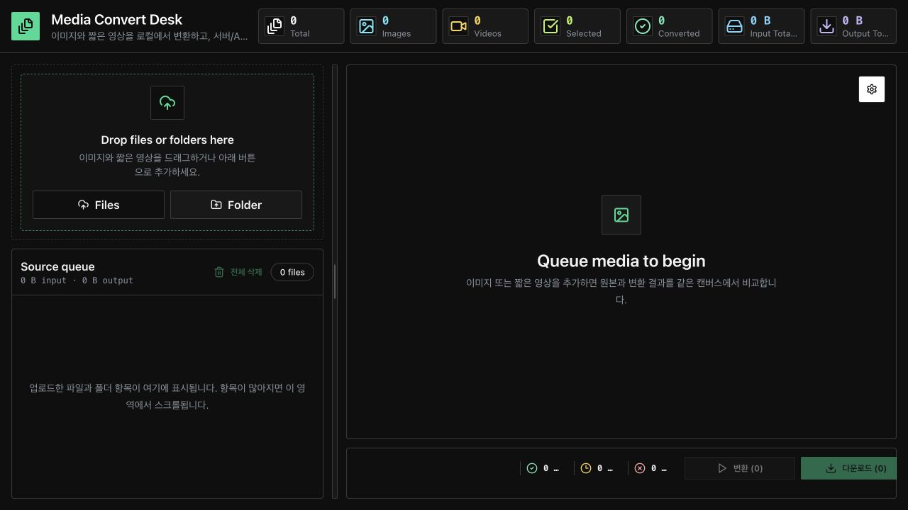
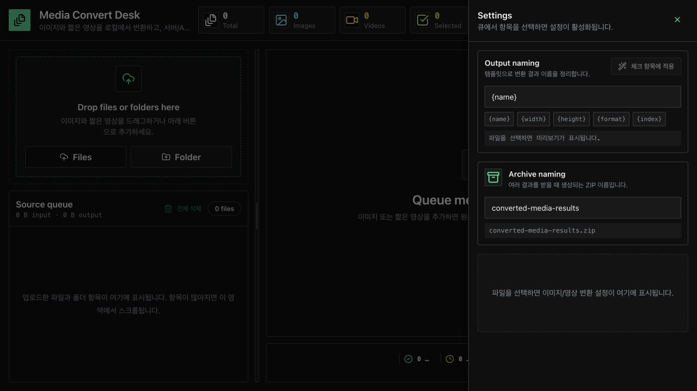

# Media Convert Desk

이미지와 짧은 영상을 브라우저에서 우선 변환하는 Next.js 기반 미디어 변환 대시보드입니다.

현재 구현 범위는 이미지 MVP와 영상 MVP입니다. 서버 큐, AI 화질 개선, 고품질 AVIF 변환은 실제 처리 없이 API 계약과 타입 구조만 준비되어 있습니다.

## 1. 화면 구성

### Dashboard

첫 화면은 업로드, Source queue, Preview canvas, 변환/다운로드 액션을 한 화면에서 다루는 작업형 대시보드입니다.



- 상단: Total, Images, Videos, Selected, Converted, Input Total Size, Output Total Size 요약
- 좌측: 파일/폴더 업로드, Source queue, 그룹/아이템 선택 및 정렬
- 중앙: Original / Result preview canvas와 하단 변환/다운로드 액션바
- 우측: 톱니바퀴 버튼으로 여는 Settings drawer

### Settings Drawer

Settings drawer는 출력 이름, ZIP 이름, 선택 파일별 이미지/영상 변환 설정을 관리합니다.



- Output naming: `{name}`, `{width}`, `{height}`, `{format}`, `{index}` 토큰 기반 결과 파일명
- Archive naming: 여러 결과를 받을 때 생성되는 ZIP 파일명
- Output settings: 선택된 파일 타입에 맞는 포맷, 품질, 크기 설정

## 2. 빠른 실행

```bash
npm install
npm run dev
```

브라우저에서 `http://localhost:3000`을 엽니다.

## 3. 기본 사용 흐름

1. `Files` 또는 `Folder`로 이미지/영상을 추가합니다.
2. Source queue에서 변환할 항목을 체크합니다.
3. 필요하면 파일명, 폴더명, 그룹/아이템 순서를 수정합니다.
4. Settings에서 출력 포맷, 품질, 리사이즈, 결과 파일명, ZIP 이름을 조정합니다.
5. 하단 `변환 (N)` 버튼으로 체크된 미변환 항목을 변환합니다.
6. `다운로드 (N)` 버튼으로 변환 완료 항목을 저장합니다.

지원하지 않는 파일은 Source queue에 빨간 라인으로 표시됩니다. 업로드 경고의 파일명을 클릭하면 해당 항목으로 스크롤됩니다.

## 4. 기능 그룹

### 업로드와 Source Queue

- 이미지/영상 파일 업로드
- 폴더 업로드 및 폴더 그룹 표시
- 폴더 그룹 접기/펼치기
- 그룹 단위 선택, 개별 파일 선택, 전체 선택
- 그룹/아이템 드래그 정렬
- 파일명과 폴더 그룹명 인라인 수정
- 좌측 패널 desktop 리사이즈

### 이미지 변환

- JPG, PNG, WEBP 출력
- Quality 설정
- 비율 유지 리사이즈
- JPG 변환 시 투명 영역 배경색 합성
- 결과 Blob 크기 기준으로 UI 용량과 실제 다운로드 용량 정렬

### 영상 변환

- 작은 MP4, WEBM 파일을 브라우저 FFmpeg.wasm으로 처리
- MP4/WEBM 출력
- 해상도 변경
- bitrate/CRF 기반 압축 옵션
- 데스크톱 기본 제한: 100MB 또는 2분 이하
- 모바일 기본 제한: 50MB 또는 1분 이하

### Preview Canvas

- Original / Result 나란히 비교
- 변환 전/후 metadata 표시
- 파일 크기는 읽기 쉬운 값과 정확한 byte 값을 함께 표시
- 50%부터 1000%까지 zoom
- 확대 상태에서 Original/Result pan 위치 동기화

### 다운로드

- 변환과 다운로드 액션 분리
- 단일 결과는 개별 파일로 다운로드
- 여러 결과는 내부적으로 ZIP 생성
- ZIP 파일명 설정
- 변경된 파일명은 변환 결과 다운로드명에도 반영

## 5. 프로젝트 구조

```txt
image-converter/
├── app/
│   ├── api/
│   │   ├── images/
│   │   │   ├── convert/route.ts
│   │   │   └── enhance/route.ts
│   │   ├── jobs/
│   │   │   ├── [id]/route.ts
│   │   │   └── route.ts
│   │   └── videos/
│   │       ├── convert/route.ts
│   │       └── enhance/route.ts
│   ├── layout.tsx
│   └── page.tsx
├── components/
│   └── ui/
├── constants/
├── features/
│   ├── download/
│   ├── image/
│   ├── media/
│   ├── upload/
│   └── video/
├── lib/
│   ├── ffmpeg/
│   ├── image/
│   ├── media/
│   ├── server/
│   ├── validation/
│   └── video/
├── public/
│   └── readme/
├── stores/
├── types/
└── workers/
```

## 6. 기술 스택

### App / UI

- Next.js App Router
- React
- TypeScript
- Tailwind CSS
- shadcn 스타일 UI primitive
- lucide-react

### Media Processing

- Canvas API
- createImageBitmap
- FFmpeg.wasm
- file-saver
- JSZip

### State / Test

- Zustand
- Vitest
- Testing Library

## 7. 검증 명령

```bash
npm test
npm run typecheck
npm run build
```

## 8. 서버 API 상태

MVP에서는 서버 처리를 실제로 수행하지 않습니다. 아래 API는 계약 고정을 위한 `501 Not Implemented` 스텁입니다.

```txt
POST   /api/images/convert
POST   /api/images/enhance
POST   /api/videos/convert
POST   /api/videos/enhance
POST   /api/jobs
GET    /api/jobs/:id
DELETE /api/jobs/:id
```

## 9. 현재 제외된 기능

- 고급 AI 이미지/영상 화질 개선
- 대용량 서버 처리 큐
- 서버 Sharp/FFmpeg 실제 처리
- AVIF 고품질 서버 변환
- GIF 변환, 구간 자르기, FPS 변경, 오디오 제거
- ZIP 외의 고급 배치 내보내기
